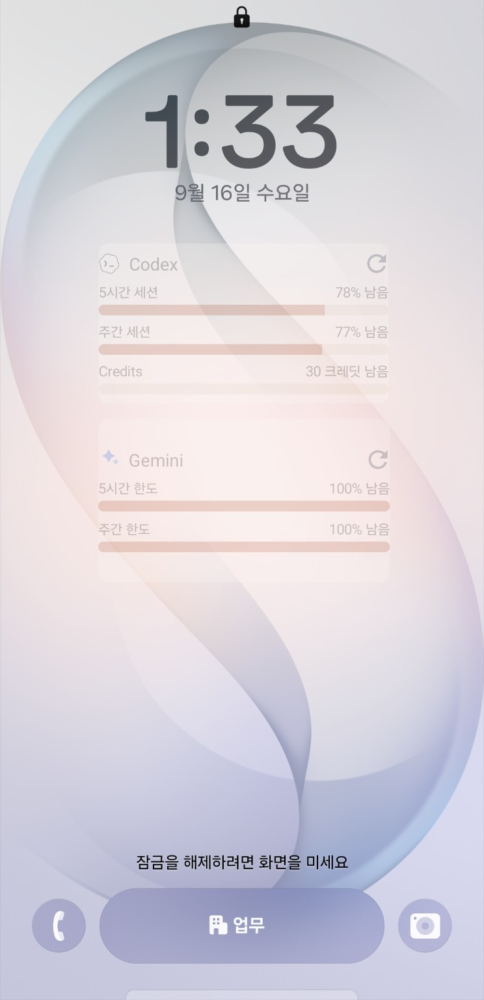

# AI Quota for Mobile AOD

[English](#english) | [한국어](#korean)

> Unofficial fork of [`datell1357/AI-Quota-for-Mobile`](https://github.com/datell1357/AI-Quota-for-Mobile) for a personal Galaxy S26 / One UI 8.5 / Good Lock / LockStar AOD extension. It is separate from upstream and is not the official Google Play app or an official distribution of upstream, Google, Samsung, Anthropic, OpenAI, or any provider named below.
>
> Verified on the maintainer's Galaxy S26 / One UI 8.5 setup. Compatibility with other Galaxy models, One UI versions, launchers, or LockStar releases is not guaranteed. See [NOTICE.md](NOTICE.md) for attribution and the scoped license information.

## Galaxy S26 AOD

Real-device verification completed on Galaxy S26 / One UI 8.5 with Samsung Good Lock / LockStar, including Android widget picker visibility, LockStar placement, lock-screen display, AOD display, and normal operation.



---

## English

AI Quota for Mobile is an Android app for checking AI provider usage limits from one place. It supports a local-first dashboard, home screen widgets, and an optional pinned foreground refresh notification.

This fork adds a personal Galaxy S26 / One UI 8.5 experiment for showing the Codex quota as a compact widget that can be selected from Samsung Good Lock / LockStar where third-party AppWidgets are supported. It is based on the upstream `datell1357/AI-Quota-for-Mobile` project and does not guarantee AOD or lock-screen support on other Galaxy models, One UI versions, launchers, or LockStar releases.

Attribution and licensing are documented in [NOTICE.md](NOTICE.md). The upstream README labels the project MIT, but that does not relicense upstream code or third-party assets under this fork's own notice.

### Current Status

The Android app is being prepared for Google Play internal testing.

No release APK or AAB is committed to the current branch or attached to its GitHub Releases at the time of this review. A locally built artifact is not an official upstream or Google Play distribution.

Current upload artifact:

```text
android/app/build/outputs/bundle/release/app-release.aab
```

### Features

- Local-first provider usage dashboard.
- Home screen widgets for quick quota checks.
- Optional pinned notification for foreground refresh.
- Manual and foreground-service refresh paths.
- Provider hide/reorder settings.
- Korean and English UI strings.
- Google Play release signing and store listing assets prepared.

### Supported Providers

| Provider | Status |
| --- | --- |
| Claude | Supported |
| Codex | Supported |
| Gemini | Supported |
| GitHub Copilot | Supported |
| Antigravity | Supported |
| Cursor | Supported |

### Android Package

Google Play package name:

```text
com.aiquota.mobile
```

The Kotlin namespace is still `com.aiquota.mobile` internally. That is an implementation detail and does not change the Google Play package name.

This package/applicationId is intentionally retained for upstream compatibility. A source build from this repository is not an update to the official Play app and may use a different signing key. Before publicly distributing an APK or registering a Play listing, use an independent applicationId/package, signing key, Firebase project, OAuth configuration, app name, icon, and store identity.

### Privacy

- [Privacy Policy](docs/privacy-policy.html)
- [Account and Data Deletion](docs/account-deletion.html)

### Build From Source

Requirements:

- Windows development machine.
- Android Studio with Android SDK.
- JDK 17. Android Studio JBR works.
- Firebase project configured for Android package `com.aiquota.mobile`.
- `android/app/google-services.json`.
- Existing Gradle wrapper distribution or Gradle 8.10.2.

Run tests:

```powershell
npm.cmd test
```

```powershell
& '.\.tmp\tools\gradle-8.10.2\bin\gradle.bat' -p android :app:testDebugUnitTest
```

Build debug APK:

```powershell
& '.\.tmp\tools\gradle-8.10.2\bin\gradle.bat' -p android :app:assembleDebug
```

Debug APK output:

```text
android/app/build/outputs/apk/debug/app-debug.apk
```

Install the debug APK on a connected device:

```powershell
adb install -r android/app/build/outputs/apk/debug/app-debug.apk
```

Galaxy S26 / One UI 8.5 check:

1. Open AI Quota, connect Codex, and refresh until the 5-hour and weekly quota data is visible in the app.
2. Confirm the `AI Quota Codex AOD` widget appears in the Android widget picker.
3. Open Samsung Good Lock / LockStar and edit the lock screen or AOD layout available on your installed version.
4. Add the `AI Quota Codex AOD` widget and confirm the `5H` and `W` percentages plus reset text are readable while the phone is on the standing charger.
5. Treat the result as device/version specific until it has been checked on the exact Galaxy S26 / One UI / LockStar combination you use.

Build Google Play AAB:

```powershell
& '.\.tmp\tools\gradle-8.10.2\bin\gradle.bat' -p android :app:bundleRelease
```

Output:

```text
android/app/build/outputs/bundle/release/app-release.aab
```

### License

See [NOTICE.md](NOTICE.md) for the upstream link, the upstream README's MIT statement, the checked repository state, and the limited license scope for this fork's original AOD changes. This fork does not claim ownership of upstream code or third-party assets.

---

## Korean

AI Quota for Mobile은 여러 AI provider의 사용량을 한곳에서 확인하기 위한 Android 앱입니다. 로컬 우선 대시보드, 홈 화면 위젯, 선택 가능한 고정 알림 기반 foreground refresh를 제공합니다.

이 fork는 upstream `datell1357/AI-Quota-for-Mobile`을 기반으로 Galaxy S26 / One UI 8.5에서 Codex quota를 Samsung Good Lock / LockStar를 통해 잠금화면 또는 AOD에 배치해 보기 위한 개인용 실험을 추가합니다. 다른 Galaxy 모델, One UI 버전, 런처, LockStar 버전에서의 AOD/잠금화면 동작은 보장하지 않습니다.

라이선스와 출처 범위는 [NOTICE.md](NOTICE.md)에 정리되어 있습니다. upstream README는 프로젝트를 MIT라고 표시하지만, 이 fork의 고지가 upstream 코드나 제3자 자산의 저작권을 새로 부여하거나 이전한다는 뜻은 아닙니다.

### 현재 상태

Android 앱은 Google Play 내부 테스트 등록을 준비 중입니다.

현재 업로드 산출물:

```text
android/app/build/outputs/bundle/release/app-release.aab
```

### 주요 기능

- 로컬 우선 provider 사용량 대시보드.
- 빠른 quota 확인을 위한 홈 화면 위젯.
- foreground refresh를 위한 선택 가능한 고정 알림.
- 수동 refresh와 foreground service refresh.
- provider 숨김 및 순서 변경 설정.
- 한국어와 영어 UI 문자열.
- Google Play release signing 및 스토어 등록 asset 준비.

### 지원 Provider

| Provider | 상태 |
| --- | --- |
| Claude | 지원 |
| Codex | 지원 |
| Gemini | 지원 |
| GitHub Copilot | 지원 |
| Antigravity | 지원 |
| Cursor | 지원 |

### Android 패키지

Google Play 패키지 이름:

```text
com.aiquota.mobile
```

Kotlin namespace는 내부 구현 사항으로 `com.aiquota.mobile`을 유지합니다. Google Play 패키지 이름과는 별개입니다.

이 package/applicationId는 upstream 호환성을 위해 현재 유지합니다. 이 저장소에서 직접 빌드한 APK는 공식 Play 앱의 업데이트가 아니며 signing key가 다를 수 있습니다. 공개 APK 배포나 Google Play 등록 전에는 독립적인 applicationId/package, signing key, Firebase 프로젝트, OAuth 설정, 앱 이름, 아이콘, 스토어 identity를 사용해야 합니다.

### 개인정보 및 데이터 삭제

- [개인정보처리방침](docs/privacy-policy.html)
- [계정 및 데이터 삭제 안내](docs/account-deletion.html)

### 소스에서 빌드

필수 조건:

- Windows 개발 환경.
- Android Studio 및 Android SDK.
- JDK 17. Android Studio JBR 사용 가능.
- Android 패키지 `com.aiquota.mobile`로 설정된 Firebase 프로젝트.
- `android/app/google-services.json`.
- 기존 Gradle wrapper 배포본 또는 Gradle 8.10.2.

테스트:

```powershell
npm.cmd test
```

```powershell
& '.\.tmp\tools\gradle-8.10.2\bin\gradle.bat' -p android :app:testDebugUnitTest
```

Debug APK 빌드:

```powershell
& '.\.tmp\tools\gradle-8.10.2\bin\gradle.bat' -p android :app:assembleDebug
```

Debug APK 출력:

```text
android/app/build/outputs/apk/debug/app-debug.apk
```

연결된 기기에 Debug APK 설치:

```powershell
adb install -r android/app/build/outputs/apk/debug/app-debug.apk
```

Galaxy S26 / One UI 8.5 확인 절차:

1. AI Quota를 열어 Codex를 연결하고 앱에서 5시간/주간 quota 데이터가 보일 때까지 갱신합니다.
2. Android 위젯 선택 화면에 `AI Quota Codex AOD`가 표시되는지 확인합니다.
3. Samsung Good Lock / LockStar에서 현재 버전이 제공하는 잠금화면 또는 AOD 편집 화면을 엽니다.
4. `AI Quota Codex AOD` 위젯을 추가하고 스탠딩 충전 상태에서 `5H`, `W`, 각 reset 정보가 읽을 수 있게 표시되는지 확인합니다.
5. 실제 사용 중인 Galaxy S26 / One UI / LockStar 조합에서 직접 확인하기 전에는 범용 호환으로 보지 않습니다.

Google Play AAB 빌드:

```powershell
& '.\.tmp\tools\gradle-8.10.2\bin\gradle.bat' -p android :app:bundleRelease
```

출력:

```text
android/app/build/outputs/bundle/release/app-release.aab
```

### 라이선스

[NOTICE.md](NOTICE.md)에 upstream 출처, 확인된 라이선스 상태, 이 fork의 원본 AOD 변경사항에 대한 제한된 라이선스 범위를 정리했습니다.
